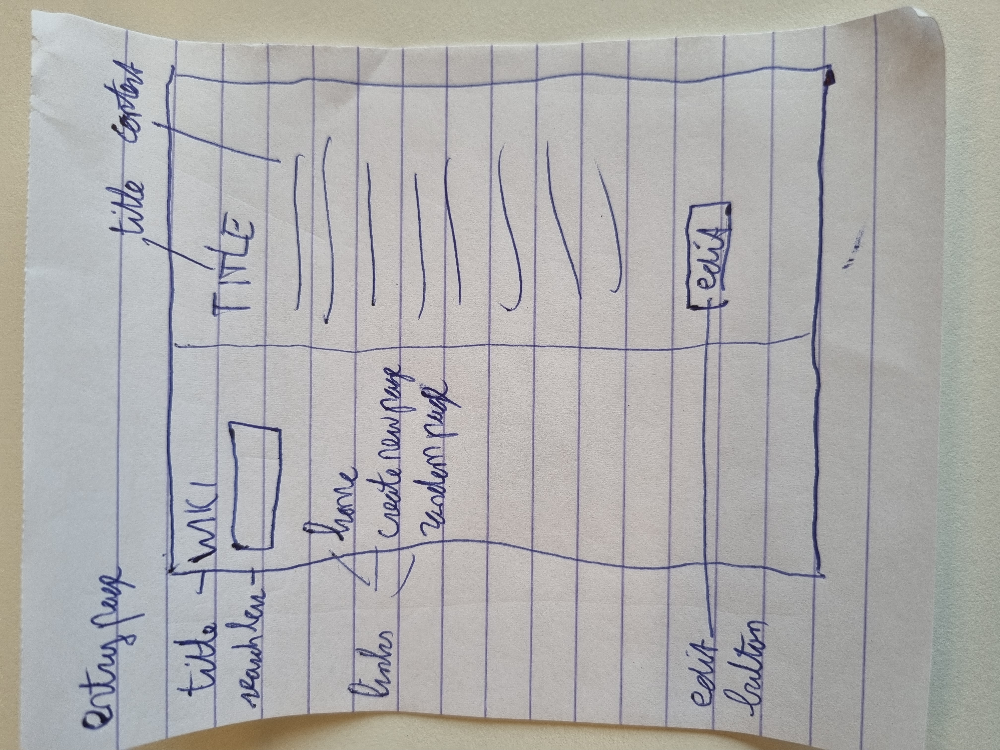
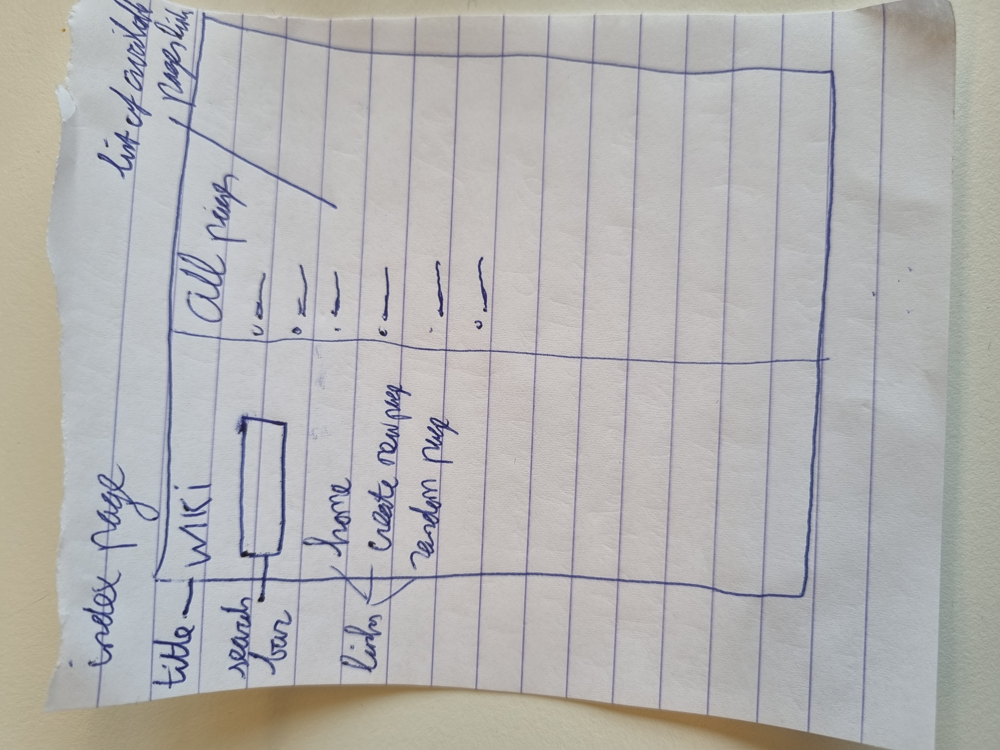
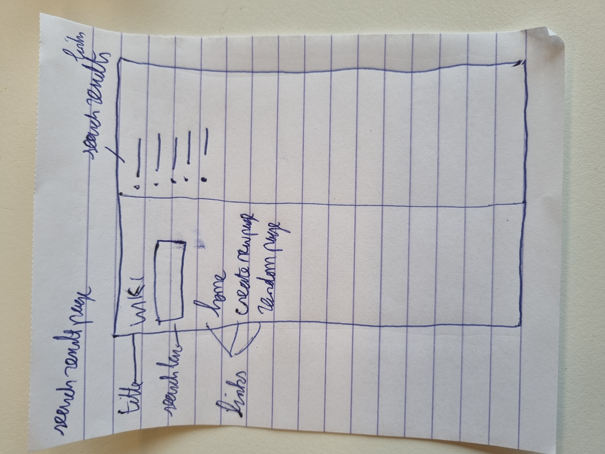
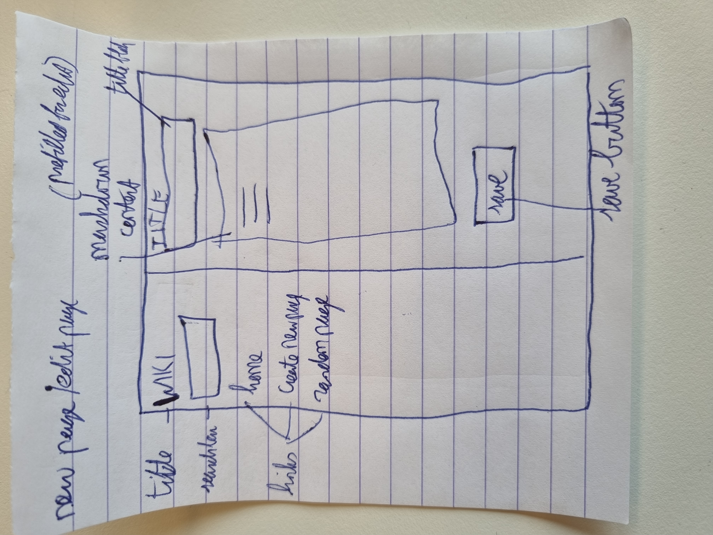

# Wiki-like encyclopedia

This application will create a wiki-like encyclopedia, consisting of the following pages:

Entry Page: Visiting /wiki/TITLE, where TITLE is the title of an encyclopedia entry, should render a page that displays the contents of that encyclopedia entry.
	The view should get the content of the encyclopedia entry by calling the get_entry util function.
	If an entry is requested that does not exist, the user should be presented with an error page indicating that their requested page was not found.
	If the entry does exist, the user should be presented with a page that displays the content of the entry. The title of the page should include the name of the entry.
	Actions to create the first pages: 
	*each entry has to be added in encyclopedia/urls.py\
	*each entry has to be added in encyclopedia/views.py\
	*a new html page should be created in encyclopedia/templates/encyclopedia that can be used for all TITLE pages, to be filled with the information from the md file.\
	
Index Page: The index page should supply a list of all the existing encyclopedia entries, using the list_entries util function. 
	A user can click on any entry name to be taken directly to that entry page.
	
Search: Allow the user to type a query into the search box in the sidebar to search for an encyclopedia entry.
	If the query matches the name of an encyclopedia entry from the list_entries util function, the user should be redirected to that entry’s page.
        If the query does not match the name of an encyclopedia entry, the user should instead be taken to a search results page that displays a list of all encyclopedia entries that 
	have the query as a substring. For example, if the search query were Py, then Python should appear in the search results.
        Clicking on any of the entry names on the search results page should take the user to that entry’s page.\
	*an entry has to be added in encyclopedia/urls.py\
	*an entry has to be added in encyclopedia/views.py\
	*a new html page should be created in encyclopedia/templates/encyclopedia
	
New Page: Clicking “Create New Page” in the sidebar should take the user to a page where they can create a new encyclopedia entry.
        Users should be able to enter a title for the page and, in a textarea, should be able to enter the Markdown content for the page.
        Users should be able to click a button to save their new page, using the save_entry util function.
        When the page is saved, if an encyclopedia entry already exists with the provided title using the list_entries util function, the user should be presented with an error message.
        Otherwise, the encyclopedia entry should be saved to disk, and the user should be taken to the new entry’s page.
	Actions to create a new page: \
	*each entry has to be added in encyclopedia/urls.py\
	*new md file has to be created in the entries folder
	
Edit Page (extra): On each entry page, the user should be able to click a link to be taken to a page where the user can edit that entry’s Markdown content in a textarea.
        The textarea should be pre-populated with the existing Markdown content of the page. (i.e., the existing content should be the initial value of the textarea).
        The user should be able to click a button to save the changes made to the entry.
        Once the entry is saved, the user should be redirected back to that entry’s page.\
	*the changes are made in the md file for the page
	
Random Page (extra): Clicking “Random Page” in the sidebar should take user to a random encyclopedia entry.\
	*an entry has to be added in encyclopedia/views.py
Error Page: Page that displays an error for a non-existing title, or for an existing new page

## Getting Started

Describe steps to install requirements and get the application running\
pip3 install Django\
pip3 install markdown2\
python manage.py runserver\
The URL is available at http://127.0.0.1:8000/

